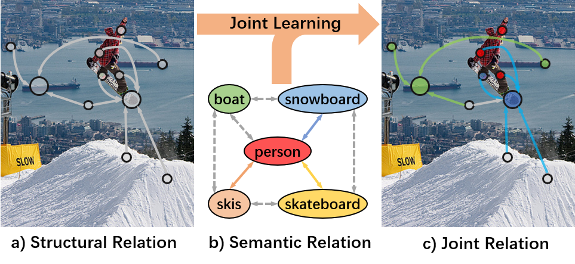
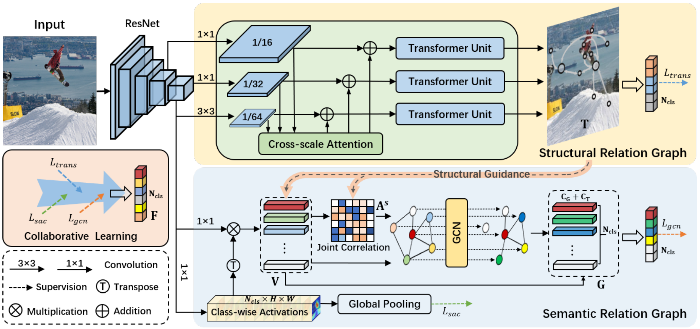
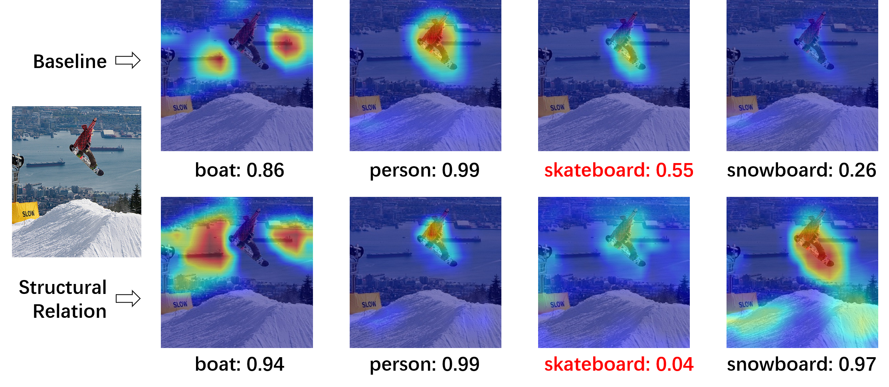

# TDRG
Unofficial PyTorch implementation of the paper [Transformer-based Dual Relation Graph for Multi-label Image Recognition. ICCV 2021](https://openaccess.thecvf.com/content/ICCV2021/html/Zhao_Transformer-Based_Dual_Relation_Graph_for_Multi-Label_Image_Recognition_ICCV_2021_paper.html)



## Architecture
The overall architecture of the proposed Transformer-based Dual Relation Graph (TDRG) network, the structural relation graph module to incorporate long-term contextual information, and the semantic relation graph module to model the dynamic class-wise dependencies.



## Reproducing result


|DataSet | Author | Reproducing |
|:----:  | :----: | :---------: |
|MS-COCO |  84.56 |    84.75    |
|VOC 2007|  94.95 |    95.10    |


## Prerequisites

Python 3.8
Pytorch 1.8.1
CUDA 11.6
RTX3090 × 1

## Datasets

- MS-COCO: [train](http://images.cocodataset.org/zips/train2014.zip)  [val](http://images.cocodataset.org/zips/val2014.zip)  [annotations](http://images.cocodataset.org/annotations/annotations_trainval2014.zip)
- VOC 2007: [trainval](http://host.robots.ox.ac.uk/pascal/VOC/voc2007/VOCtrainval_06-Nov-2007.tar)  [test](http://host.robots.ox.ac.uk/pascal/VOC/voc2007/VOCtest_06-Nov-2007.tar)  [test_anno](http://host.robots.ox.ac.uk/pascal/VOC/voc2007/VOCtestnoimgs_06-Nov-2007.tar)

## Train

```
python main.py -d -s -up
```

## Test

```
python main.py -d -s -up -e --resume checkpoint/COCO2014/checkpoint_COCO.pth
```

## Visualization



## Citation

- If you find this work is helpful, please cite the paper

```
@InProceedings{Zhao2021TDRG,
    author    = {Zhao, Jiawei and Yan, Ke and Zhao, Yifan and Guo, Xiaowei and Huang, Feiyue and Li, Jia},
    title     = {Transformer-Based Dual Relation Graph for Multi-Label Image Recognition},
    booktitle = {Proceedings of the IEEE/CVF International Conference on Computer Vision (ICCV)},
    month     = {October},
    year      = {2021},
    pages     = {163-172}
}
```